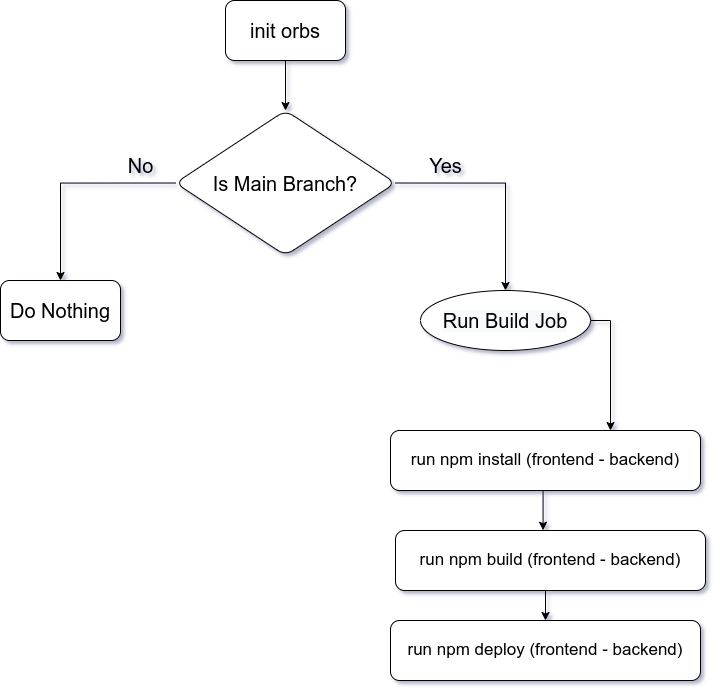

# CircleCI pipeline

- use nodejs, aws-cli and eb-cli orbs
- filter build job for main repo
- run build job :
  - install nodejs
  - checkout from the repo
  - setup aws cli and eb cli credintials
  - run frontend install
  - run backend install
  - run frontend build
  - run backend build
  - run frontend deploy (upload build in s3 bucket)
  - run backend deploy (upload build project to elastic beanstalk bucket and setup env variables in cloud)

## Diagram

